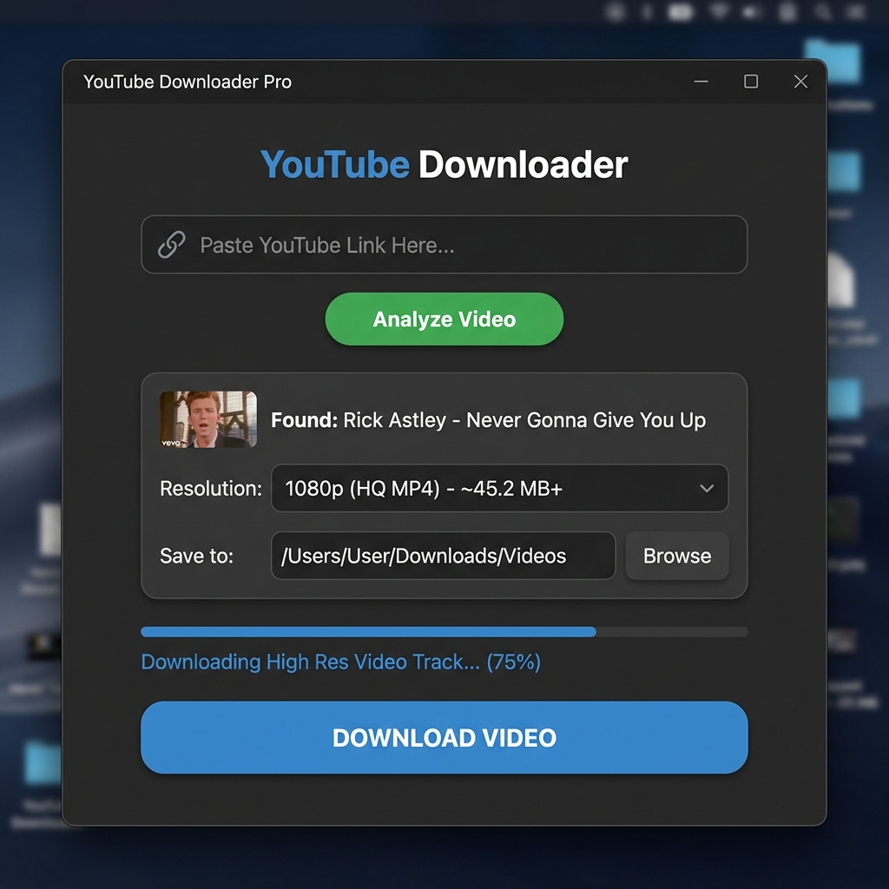

<div align="center">

# 🎬 YouTube Downloader Pro

**A sleek, modern desktop app to download YouTube videos in up to 4K quality.**

Built with Python · CustomTkinter · FFmpeg



[](https://python.org)
[](LICENSE)
[](https://github.com/Deep-tech-1314/YouTube-Downloader-Pro)

</div>

---

## ✨ Features

| Feature | Description |
|---------|-------------|
| 🎥 **Up to 4K** | Download videos in 720p, 1080p, 1440p, and 4K |
| 🔀 **Smart Merge** | Auto-merges separate audio + video tracks for high-res downloads |
| 🎨 **Dark Mode UI** | Modern, clean interface built with CustomTkinter |
| 📦 **Zero Config FFmpeg** | FFmpeg bundled via `imageio-ffmpeg` — no manual install needed |
| 🛡️ **Safe Filenames** | Handles emojis, special characters, and long titles without crashing |
| 🔄 **Auto Fallback** | If fast-copy merge fails, automatically re-encodes to H.264 |

---

## 🚀 Quick Start

### 1. Clone the repository

```bash
git clone https://github.com/Deep-tech-1314/YouTube-Downloader-Pro.git
cd YouTube-Downloader-Pro
```

### 2. Install dependencies

```bash
pip install -r requirements.txt
```

### 3. Run the app

```bash
python main.py
```

---

## 📦 Dependencies

| Package | Purpose |
|---------|---------|
| `pytubefix` | Fetches and downloads YouTube streams |
| `customtkinter` | Modern dark-themed GUI framework |
| `imageio-ffmpeg` | Provides FFmpeg binary for audio/video merging |

---

## 🔧 How It Works

```
Paste URL → Analyze → Pick Quality → Download
```

1. **Analyze** — Scans the video URL and lists all available resolutions
2. **Progressive streams** (≤720p) — Direct download, ready to play instantly  
3. **Adaptive streams** (1080p+) — Downloads video & audio separately, then merges them with FFmpeg into a single MP4

> If the fast-copy merge encounters codec issues, the app automatically falls back to full H.264 re-encoding to guarantee a playable file.

---

## 📁 Project Structure

```
YouTube-Downloader-Pro/
├── main.py            # Application source code
├── requirements.txt   # Python dependencies
├── GUIDE.md           # Detailed technical guide
├── preview.png        # App screenshot
└── README.md          # You are here
```

---

## 🐛 Troubleshooting

| Issue | Fix |
|-------|-----|
| **Merge Failed** | Check if your antivirus is blocking `ffmpeg.exe` |
| **No Streams Found** | The video may be age-restricted or region-locked |
| **Slow Merging** | Re-encode mode activated for incompatible codecs — this is normal |

---

## 📄 License

This project is open source under the [MIT License](LICENSE).

---

<div align="center">

**Made with ❤️ and Python**

⭐ Star this repo if you found it useful!

</div>
